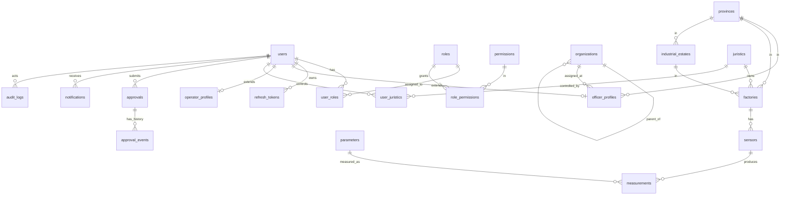

# POMS — Database Schema Design

> Status: **APPROVED for Phase 1** (auth + users + roles + organizations + juristics + factories)
> DB: Microsoft SQL Server | Charset: NVARCHAR (Thai support) | Time: DATETIME2 (Asia/Bangkok)
>
> **Phase 1 scope:** identity + RBAC + org hierarchy + juristic/factory CRUD + audit
> **Phase 2 (deferred):** parameters, sensors, measurements, measurements_hourly
> **Phase 3 (deferred):** approvals, approval_events, notifications (email transport)

---

## 1. Design principles

1. **Federated auth** — POMS ไม่เก็บ password ของ user (ยกเว้น admin บัญชี local). คอลัมน์ `external_id` + `identity_provider` ผูกกับระบบภายนอก (กรอ. HR / ระบบผู้ประกอบการ)
2. **Soft delete ทั้งหมด** — ทุก entity table มี `deleted_at DATETIME2 NULL`. Query ทั้งหมด filter `deleted_at IS NULL` ผ่าน base repository
3. **Audit columns ทุก table** — `created_at`, `updated_at`, `created_by`, `updated_by` (FK to users.id, NULL สำหรับ system actions)
4. **Sensor data partitioned by month** — เก็บ raw หลายปี → ต้อง partition `measurements` table เพื่อ prune scan
5. **Polymorphic approvals** — 1 ตาราง `approvals` ใช้ครอบทุก feature ที่มี approval workflow (`target_type` + `target_id`)
6. **Use BIGINT IDENTITY** ทุก internal PK + เก็บ `external_id` คู่กันสำหรับ ID ภายนอก (citizen_id 13 หลัก, fid 14 หลัก ฯลฯ)
7. **Timezone = Asia/Bangkok ใน DB** — Server timezone ตั้งเป็น `SE Asia Standard Time` (+07, ไม่มี DST). ทุก `DATETIME2` เก็บเวลา local Bangkok. Default ใช้ `SYSDATETIME()` (server-local) ไม่ใช่ `SYSUTCDATETIME()`

---

## 2. ERD (Mermaid)



---

## 3. Identity & access (RBAC)

### 3.1 `users` — unified user table (cache จาก external provider)

```sql
CREATE TABLE users (
  id                  BIGINT IDENTITY(1,1) NOT NULL PRIMARY KEY,
  external_id         VARCHAR(32)     NOT NULL,   -- citizen_id (13) / per_cardno (13) / 'admin'
  identity_provider   VARCHAR(32)     NOT NULL,   -- 'mock' | 'citizen' | 'operator_gateway' | 'officer_hr' | 'local'
  user_type           VARCHAR(16)     NOT NULL,   -- 'citizen' | 'operator' | 'officer' | 'admin'
  username            NVARCHAR(64)    NULL,
  email               NVARCHAR(255)   NULL,
  phone               VARCHAR(32)     NULL,
  prename_th          NVARCHAR(16)    NULL,       -- 'นาย', 'นาง'
  first_name          NVARCHAR(128)   NOT NULL,
  last_name           NVARCHAR(128)   NOT NULL,
  is_active           BIT             NOT NULL DEFAULT 1,
  password_hash       VARBINARY(256)  NULL,       -- ใช้เฉพาะ admin local + mock เท่านั้น
  last_login_at       DATETIME2       NULL,
  last_synced_at      DATETIME2       NULL,       -- เวลาที่ sync จาก external
  created_at          DATETIME2       NOT NULL DEFAULT SYSDATETIME(),
  updated_at          DATETIME2       NOT NULL DEFAULT SYSDATETIME(),
  created_by          BIGINT          NULL,
  updated_by          BIGINT          NULL,
  deleted_at          DATETIME2       NULL,
  CONSTRAINT uq_users_provider UNIQUE (identity_provider, external_id)
);
CREATE INDEX ix_users_username   ON users(username) WHERE deleted_at IS NULL;
CREATE INDEX ix_users_user_type  ON users(user_type);
```

### 3.2 `officer_profiles` — ข้อมูลเฉพาะเจ้าหน้าที่ (จาก HR กรอ.)

```sql
CREATE TABLE officer_profiles (
  user_id             BIGINT          NOT NULL PRIMARY KEY,
  pos_no              VARCHAR(16)     NULL,       -- "539"
  pertype_id          VARCHAR(8)      NULL,       -- "5"
  pertype             NVARCHAR(128)   NULL,       -- "ข้าราชการพลเรือนสามัญ"
  position_type_id    VARCHAR(8)      NULL,       -- "2"
  position_type_th    NVARCHAR(64)    NULL,       -- "วิชาการ"
  line_id             VARCHAR(8)      NULL,       -- "20"
  line_name_th        NVARCHAR(128)   NULL,       -- "นักวิชาการคอมพิวเตอร์"
  level_id            VARCHAR(8)      NULL,       -- "17"
  level_name_th       NVARCHAR(64)    NULL,       -- "ชำนาญการ"
  mposition_id        VARCHAR(8)      NULL,
  mposition           NVARCHAR(128)   NULL,
  organize_id         VARCHAR(16)     NULL,       -- "3010073"
  division_id         VARCHAR(16)     NULL,       -- "3010071"
  department_id       VARCHAR(16)     NULL,       -- "3010000"
  ministry_id         VARCHAR(8)      NULL,       -- "22"
  province_id         VARCHAR(8)      NULL,       -- "1000"
  per_status          VARCHAR(8)      NULL,       -- "1"
  per_status_name     NVARCHAR(64)    NULL,       -- "ปกติ"
  relocation_type     VARCHAR(8)      NULL,
  relocation_name     NVARCHAR(128)   NULL,
  synced_at           DATETIME2       NULL,
  CONSTRAINT fk_officer_user FOREIGN KEY (user_id) REFERENCES users(id)
);
CREATE INDEX ix_officer_division ON officer_profiles(division_id);
CREATE INDEX ix_officer_province ON officer_profiles(province_id);
```

### 3.3 `operator_profiles` — ข้อมูลเฉพาะผู้ประกอบการ

```sql
CREATE TABLE operator_profiles (
  user_id             BIGINT          NOT NULL PRIMARY KEY,
  user_code           VARCHAR(16)     NULL,       -- "53495"
  regis_date          DATETIME2       NULL,
  synced_at           DATETIME2       NULL,
  CONSTRAINT fk_operator_user FOREIGN KEY (user_id) REFERENCES users(id)
);
```

### 3.4 `roles` + `permissions` + `role_permissions` + `user_roles`

```sql
CREATE TABLE roles (
  id              BIGINT IDENTITY(1,1) NOT NULL PRIMARY KEY,
  code            VARCHAR(32)         NOT NULL UNIQUE,    -- 'admin', 'factory_operator'
  name_th         NVARCHAR(128)       NOT NULL,
  name_en         NVARCHAR(128)       NOT NULL,
  description     NVARCHAR(500)       NULL,
  is_system       BIT                 NOT NULL DEFAULT 0,  -- ห้าม user แก้/ลบ
  created_at      DATETIME2           NOT NULL DEFAULT SYSDATETIME(),
  updated_at      DATETIME2           NOT NULL DEFAULT SYSDATETIME(),
  deleted_at      DATETIME2           NULL
);

CREATE TABLE permissions (
  id              BIGINT IDENTITY(1,1) NOT NULL PRIMARY KEY,
  code            VARCHAR(64)         NOT NULL UNIQUE,    -- 'factories:view'
  resource        VARCHAR(32)         NOT NULL,           -- 'factories'
  action          VARCHAR(16)         NOT NULL,           -- 'view'
  description     NVARCHAR(255)       NULL
);

CREATE TABLE role_permissions (
  role_id         BIGINT              NOT NULL,
  permission_id   BIGINT              NOT NULL,
  scope           VARCHAR(16)         NULL,               -- 'ALL'|'IN_PROVINCE'|'IN_ESTATE'|'OWN_FACTORY'|NULL
  granted_at      DATETIME2           NOT NULL DEFAULT SYSDATETIME(),
  PRIMARY KEY (role_id, permission_id),
  CONSTRAINT fk_rp_role FOREIGN KEY (role_id) REFERENCES roles(id),
  CONSTRAINT fk_rp_perm FOREIGN KEY (permission_id) REFERENCES permissions(id)
);

CREATE TABLE user_roles (
  user_id         BIGINT              NOT NULL,
  role_id         BIGINT              NOT NULL,
  assigned_at     DATETIME2           NOT NULL DEFAULT SYSDATETIME(),
  assigned_by     BIGINT              NULL,
  PRIMARY KEY (user_id, role_id),
  CONSTRAINT fk_ur_user FOREIGN KEY (user_id) REFERENCES users(id),
  CONSTRAINT fk_ur_role FOREIGN KEY (role_id) REFERENCES roles(id)
);
```

### 3.5 `refresh_tokens` — JWT refresh token (rotation + revoke)

```sql
CREATE TABLE refresh_tokens (
  id              BIGINT IDENTITY(1,1) NOT NULL PRIMARY KEY,
  user_id         BIGINT              NOT NULL,
  token_hash      VARBINARY(32)       NOT NULL,    -- SHA-256 ของ token
  family_id       UNIQUEIDENTIFIER    NOT NULL,    -- ตรวจ token-reuse detection
  expires_at      DATETIME2           NOT NULL,
  revoked_at      DATETIME2           NULL,
  rotated_from_id BIGINT              NULL,        -- token เก่าที่ rotate มา (chain)
  user_agent      NVARCHAR(500)       NULL,
  ip_address      VARCHAR(45)         NULL,
  created_at      DATETIME2           NOT NULL DEFAULT SYSDATETIME(),
  CONSTRAINT fk_rt_user FOREIGN KEY (user_id) REFERENCES users(id)
);
CREATE UNIQUE INDEX ix_rt_hash ON refresh_tokens(token_hash);
CREATE INDEX ix_rt_user_active ON refresh_tokens(user_id, expires_at) WHERE revoked_at IS NULL;
```

---

## 4. Organization hierarchy + lookups

### 4.1 `organizations` — ลำดับชั้น ministry → department → division → organize

```sql
CREATE TABLE organizations (
  id              BIGINT IDENTITY(1,1) NOT NULL PRIMARY KEY,
  external_id     VARCHAR(16)         NOT NULL,           -- "22", "3010000", "3010071", "3010073"
  parent_id       BIGINT              NULL,
  level           VARCHAR(16)         NOT NULL,           -- 'ministry'|'department'|'division'|'organize'
  name_th         NVARCHAR(255)       NOT NULL,
  name_en         NVARCHAR(255)       NULL,
  is_active       BIT                 NOT NULL DEFAULT 1,
  created_at      DATETIME2           NOT NULL DEFAULT SYSDATETIME(),
  updated_at      DATETIME2           NOT NULL DEFAULT SYSDATETIME(),
  deleted_at      DATETIME2           NULL,
  CONSTRAINT uq_org_external UNIQUE (external_id, level),
  CONSTRAINT fk_org_parent FOREIGN KEY (parent_id) REFERENCES organizations(id)
);
CREATE INDEX ix_org_parent ON organizations(parent_id);
```

### 4.2 `provinces` — 77 จังหวัด

```sql
CREATE TABLE provinces (
  id              VARCHAR(8)          NOT NULL PRIMARY KEY,   -- "1000" = กรุงเทพ
  name_th         NVARCHAR(64)        NOT NULL,
  name_en         NVARCHAR(64)        NOT NULL,
  region          NVARCHAR(32)        NULL                    -- 'ภาคกลาง', 'ภาคเหนือ'
);
```

### 4.3 `industrial_estates` — การนิคมอุตสาหกรรม

```sql
CREATE TABLE industrial_estates (
  id              BIGINT IDENTITY(1,1) NOT NULL PRIMARY KEY,
  code            VARCHAR(16)         NOT NULL UNIQUE,
  name_th         NVARCHAR(255)       NOT NULL,
  name_en         NVARCHAR(255)       NULL,
  province_id     VARCHAR(8)          NOT NULL,
  is_active       BIT                 NOT NULL DEFAULT 1,
  created_at      DATETIME2           NOT NULL DEFAULT SYSDATETIME(),
  updated_at      DATETIME2           NOT NULL DEFAULT SYSDATETIME(),
  deleted_at      DATETIME2           NULL,
  CONSTRAINT fk_estate_province FOREIGN KEY (province_id) REFERENCES provinces(id)
);
```

---

## 5. Juristics & Factories

### 5.1 `juristics` — นิติบุคคล (บริษัท)

```sql
CREATE TABLE juristics (
  id              BIGINT IDENTITY(1,1) NOT NULL PRIMARY KEY,
  juristic_id     VARCHAR(13)         NOT NULL UNIQUE,    -- "0105556125804" tax ID
  name_th         NVARCHAR(500)       NOT NULL,
  name_en         NVARCHAR(500)       NULL,
  created_at      DATETIME2           NOT NULL DEFAULT SYSDATETIME(),
  updated_at      DATETIME2           NOT NULL DEFAULT SYSDATETIME(),
  created_by      BIGINT              NULL,
  updated_by      BIGINT              NULL,
  deleted_at      DATETIME2           NULL
);
```

### 5.2 `factories` — โรงงาน

```sql
CREATE TABLE factories (
  id                  BIGINT IDENTITY(1,1) NOT NULL PRIMARY KEY,
  fid                 VARCHAR(20)         NOT NULL UNIQUE,    -- "10190003325500"
  code                VARCHAR(50)         NOT NULL,           -- "3-106-33/50สบ"
  name                NVARCHAR(500)       NOT NULL,
  juristic_id         BIGINT              NOT NULL,
  province_id         VARCHAR(8)          NOT NULL,
  industrial_estate_id BIGINT             NULL,
  system_id           INT                 NULL,               -- 12 = ระบบการอนุญาตของเสีย...
  system_detail       NVARCHAR(500)       NULL,
  verify_status       TINYINT             NOT NULL DEFAULT 0, -- 0=pending, 1=verified
  authorize_start     DATE                NULL,
  authorize_end       DATE                NULL,
  juristic_start      DATE                NULL,
  verify_date         DATE                NULL,
  is_active           BIT                 NOT NULL DEFAULT 1,
  created_at          DATETIME2           NOT NULL DEFAULT SYSDATETIME(),
  updated_at          DATETIME2           NOT NULL DEFAULT SYSDATETIME(),
  created_by          BIGINT              NULL,
  updated_by          BIGINT              NULL,
  deleted_at          DATETIME2           NULL,
  CONSTRAINT fk_factory_juristic FOREIGN KEY (juristic_id) REFERENCES juristics(id),
  CONSTRAINT fk_factory_province FOREIGN KEY (province_id) REFERENCES provinces(id),
  CONSTRAINT fk_factory_estate   FOREIGN KEY (industrial_estate_id) REFERENCES industrial_estates(id)
);
CREATE INDEX ix_factory_province ON factories(province_id) WHERE deleted_at IS NULL;
CREATE INDEX ix_factory_estate   ON factories(industrial_estate_id) WHERE deleted_at IS NULL;
CREATE INDEX ix_factory_juristic ON factories(juristic_id) WHERE deleted_at IS NULL;
```

### 5.3 `user_juristics` — ผู้ประกอบการ ↔ นิติบุคคล (M:N)

```sql
CREATE TABLE user_juristics (
  user_id         BIGINT              NOT NULL,
  juristic_id     BIGINT              NOT NULL,
  granted_at      DATETIME2           NOT NULL DEFAULT SYSDATETIME(),
  revoked_at      DATETIME2           NULL,
  PRIMARY KEY (user_id, juristic_id),
  CONSTRAINT fk_uj_user     FOREIGN KEY (user_id) REFERENCES users(id),
  CONSTRAINT fk_uj_juristic FOREIGN KEY (juristic_id) REFERENCES juristics(id)
);
```

> **Note:** user → factories ผ่าน `user_juristics` → `juristics.id = factories.juristic_id`. Helper view `v_user_factories` จะ provide flatten lookup ตอน query

---

## 6. Sensors & Measurements

### 6.1 `parameters` — dictionary จาก xlsx

```sql
CREATE TABLE parameters (
  id              BIGINT IDENTITY(1,1) NOT NULL PRIMARY KEY,
  name            NVARCHAR(128)       NOT NULL,      -- "CO2", "BOD"
  unit            VARCHAR(32)         NOT NULL,      -- "%", "mg/l"
  sensor_type     VARCHAR(16)         NOT NULL,      -- 'CEMS'|'WPMS'|'Mobile'|'Station'
  display_name    NVARCHAR(255)       NULL,          -- "CO2 (%)"
  is_active       BIT                 NOT NULL DEFAULT 1,
  CONSTRAINT uq_param UNIQUE (sensor_type, name, unit)
);
```

> Seed จาก xlsx: 21 CEMS + 5 WPMS + 129 Mobile + 126 Station

### 6.2 `sensors` — ตัว sensor ของแต่ละโรงงาน

```sql
CREATE TABLE sensors (
  id              BIGINT IDENTITY(1,1) NOT NULL PRIMARY KEY,
  factory_id      BIGINT              NOT NULL,
  sensor_type     VARCHAR(16)         NOT NULL,      -- 'CEMS'|'WPMS'|'Mobile'|'Station'
  code            VARCHAR(64)         NOT NULL,      -- รหัสจาก gateway
  name            NVARCHAR(255)       NULL,
  description     NVARCHAR(500)       NULL,
  installed_at    DATE                NULL,
  is_active       BIT                 NOT NULL DEFAULT 1,
  created_at      DATETIME2           NOT NULL DEFAULT SYSDATETIME(),
  updated_at      DATETIME2           NOT NULL DEFAULT SYSDATETIME(),
  deleted_at      DATETIME2           NULL,
  CONSTRAINT fk_sensor_factory FOREIGN KEY (factory_id) REFERENCES factories(id),
  CONSTRAINT uq_sensor_code UNIQUE (factory_id, code)
);
CREATE INDEX ix_sensor_factory ON sensors(factory_id) WHERE deleted_at IS NULL;
```

### 6.3 `measurements` — sensor reading (**partitioned by month**)

```sql
-- 1. Partition function/scheme (สร้างใน migration พิเศษ)
-- PARTITION BY RANGE LEFT for DATETIME2 with monthly boundaries

CREATE TABLE measurements (
  id              BIGINT IDENTITY(1,1) NOT NULL,
  sensor_id       BIGINT              NOT NULL,
  parameter_id    BIGINT              NOT NULL,
  recorded_at     DATETIME2           NOT NULL,           -- partition key
  value           DECIMAL(18,6)       NULL,               -- NULL = no signal / sensor down
  quality_flag   TINYINT             NOT NULL DEFAULT 0,  -- 0=good, 1=suspect, 2=bad, 3=missing
  created_at      DATETIME2           NOT NULL DEFAULT SYSDATETIME(),
  CONSTRAINT pk_measurements PRIMARY KEY CLUSTERED (recorded_at, id) ON ps_measurement_monthly(recorded_at),
  CONSTRAINT fk_meas_sensor    FOREIGN KEY (sensor_id) REFERENCES sensors(id),
  CONSTRAINT fk_meas_parameter FOREIGN KEY (parameter_id) REFERENCES parameters(id)
);
CREATE NONCLUSTERED INDEX ix_meas_sensor_recorded
  ON measurements(sensor_id, parameter_id, recorded_at DESC)
  ON ps_measurement_monthly(recorded_at);
```

> **Partitioning strategy:**
> - Partition function: monthly boundaries (`2026-01-01`, `2026-02-01`, ...)
> - Sliding window: scheduled SQL Agent job เพิ่ม partition ใหม่ทุกเดือน
> - Index align กับ partition (`ON ps_measurement_monthly`) เพื่อ partition pruning ทำงาน
> - **อย่าทำเป็น clustered index บน `id` อย่างเดียว** — query 90% filter by date range จะช้ามาก

### 6.4 (Future) `measurements_hourly`, `measurements_daily` — aggregation

```sql
-- pre-aggregated tables for fast dashboard query
-- เติมโดย scheduled job เป็น period-end summary
CREATE TABLE measurements_hourly (
  sensor_id       BIGINT      NOT NULL,
  parameter_id    BIGINT      NOT NULL,
  hour_bucket     DATETIME2   NOT NULL,
  avg_value       DECIMAL(18,6) NULL,
  min_value       DECIMAL(18,6) NULL,
  max_value       DECIMAL(18,6) NULL,
  sample_count    INT         NOT NULL,
  PRIMARY KEY (sensor_id, parameter_id, hour_bucket)
);
```

---

## 7. Workflow — Approvals (polymorphic) + Notifications

### 7.1 `approvals` — 1 ตารางใช้ครอบ 5 features

```sql
CREATE TABLE approvals (
  id              BIGINT IDENTITY(1,1) NOT NULL PRIMARY KEY,
  target_type     VARCHAR(32)         NOT NULL,
  -- 'factory_info' | 'cems_wpms_request' | 'kwp_form' | 'bod_cod_error' | 'notification_config'
  target_id       BIGINT              NOT NULL,
  submitted_by    BIGINT              NOT NULL,
  submitted_at    DATETIME2           NOT NULL DEFAULT SYSDATETIME(),
  status          VARCHAR(16)         NOT NULL DEFAULT 'SUBMITTED',
  -- 'DRAFT' | 'SUBMITTED' | 'APPROVED' | 'REJECTED'
  reviewed_by     BIGINT              NULL,
  reviewed_at     DATETIME2           NULL,
  comment         NVARCHAR(MAX)       NULL,
  created_at      DATETIME2           NOT NULL DEFAULT SYSDATETIME(),
  updated_at      DATETIME2           NOT NULL DEFAULT SYSDATETIME(),
  deleted_at      DATETIME2           NULL,
  CONSTRAINT fk_appr_submit FOREIGN KEY (submitted_by) REFERENCES users(id),
  CONSTRAINT fk_appr_review FOREIGN KEY (reviewed_by) REFERENCES users(id)
);
CREATE INDEX ix_appr_target   ON approvals(target_type, target_id) WHERE deleted_at IS NULL;
CREATE INDEX ix_appr_pending  ON approvals(status, submitted_at)   WHERE status = 'SUBMITTED';
```

### 7.2 `approval_events` — audit trail per approval

```sql
CREATE TABLE approval_events (
  id              BIGINT IDENTITY(1,1) NOT NULL PRIMARY KEY,
  approval_id     BIGINT              NOT NULL,
  event_type      VARCHAR(16)         NOT NULL,    -- 'submit'|'approve'|'reject'|'resubmit'|'comment'
  actor_user_id   BIGINT              NOT NULL,
  comment         NVARCHAR(MAX)       NULL,
  metadata        NVARCHAR(MAX)       NULL,         -- JSON เก็บ before/after diff
  created_at      DATETIME2           NOT NULL DEFAULT SYSDATETIME(),
  CONSTRAINT fk_appev_approval FOREIGN KEY (approval_id) REFERENCES approvals(id),
  CONSTRAINT fk_appev_actor    FOREIGN KEY (actor_user_id) REFERENCES users(id)
);
CREATE INDEX ix_appev_approval ON approval_events(approval_id, created_at);
```

### 7.3 `notifications` — แจ้งเตือน user

```sql
CREATE TABLE notifications (
  id                  BIGINT IDENTITY(1,1) NOT NULL PRIMARY KEY,
  recipient_user_id   BIGINT              NULL,           -- NULL = broadcast
  factory_id          BIGINT              NULL,
  type                VARCHAR(32)         NOT NULL,       -- 'threshold_exceeded'|'approval_pending'|...
  severity            VARCHAR(16)         NOT NULL DEFAULT 'info',  -- 'info'|'warning'|'critical'
  title               NVARCHAR(255)       NOT NULL,
  body                NVARCHAR(MAX)       NULL,
  payload             NVARCHAR(MAX)       NULL,           -- JSON
  is_read             BIT                 NOT NULL DEFAULT 0,
  is_starred          BIT                 NOT NULL DEFAULT 0,
  read_at             DATETIME2           NULL,
  created_at          DATETIME2           NOT NULL DEFAULT SYSDATETIME(),
  deleted_at          DATETIME2           NULL,
  CONSTRAINT fk_noti_user    FOREIGN KEY (recipient_user_id) REFERENCES users(id),
  CONSTRAINT fk_noti_factory FOREIGN KEY (factory_id) REFERENCES factories(id)
);
CREATE INDEX ix_noti_user_unread  ON notifications(recipient_user_id, created_at DESC) WHERE is_read = 0 AND deleted_at IS NULL;
CREATE INDEX ix_noti_user_starred ON notifications(recipient_user_id, created_at DESC) WHERE is_starred = 1 AND deleted_at IS NULL;
```

---

## 8. Audit logs

```sql
CREATE TABLE audit_logs (
  id              BIGINT IDENTITY(1,1) NOT NULL PRIMARY KEY,
  actor_user_id   BIGINT              NULL,            -- NULL = system action
  action          VARCHAR(64)         NOT NULL,        -- 'user.login.success', 'factory.update', 'role.assign'
  target_type     VARCHAR(32)         NULL,
  target_id       BIGINT              NULL,
  metadata        NVARCHAR(MAX)       NULL,            -- JSON: before/after, request id
  ip_address      VARCHAR(45)         NULL,
  user_agent      NVARCHAR(500)       NULL,
  created_at      DATETIME2           NOT NULL DEFAULT SYSDATETIME()
);
CREATE INDEX ix_audit_actor   ON audit_logs(actor_user_id, created_at DESC);
CREATE INDEX ix_audit_target  ON audit_logs(target_type, target_id, created_at DESC);
CREATE INDEX ix_audit_action  ON audit_logs(action, created_at DESC);
```

> Audit log **ไม่ soft delete** — append-only. Retention เป็นเรื่อง partition/archive ต่างหาก

---

## 9. Mock Identity Provider (เฟส demo)

ระหว่างที่ external API ของ กรอ. ยังไม่พร้อม — ใช้ **adapter pattern**:

### 9.1 Interface (TypeScript preview)

```ts
// src/modules/auth/identity-provider/identity-provider.interface.ts
export interface IdentityProvider {
  authenticateOfficer(username: string, password: string, departmentID: string): Promise<OfficerProfile | null>;
  authenticateOperator(citizenId: string, password: string): Promise<OperatorProfile | null>;
  authenticateCitizen(username: string, password: string): Promise<CitizenProfile | null>;
  fetchJuristicsByCitizenId(citizenId: string): Promise<JuristicWithFactories[]>;
}
```

### 9.2 Implementation switch (env)

```env
IDENTITY_PROVIDER=mock           # mock | external
MOCK_IDP_FIXTURES=./fixtures/mock-users.json
EXTERNAL_IDP_OFFICER_URL=https://hr.diw.go.th/api/auth
EXTERNAL_IDP_OPERATOR_URL=https://opr.diw.go.th/api/auth
```

### 9.3 Mock fixtures — สร้างจาก sample txt files

```json
// fixtures/mock-users.json
{
  "officers": [
    {
      "username": "weekit",
      "password": "demo1234",
      "profile": {
        "per_cardno": "1102001567054",
        "prename_th": "นาย",
        "per_name": "วีกิจ",
        "per_surname": "ชมญาติ",
        "pos_no": "539",
        "line_name_th": "นักวิชาการคอมพิวเตอร์",
        "level_name_th": "ชำนาญการ",
        "organize_id": "3010073",
        "organize_th": "กลุ่มบริการระบบสารสนเทศ 3",
        "department_id": "3010000",
        "department": "กรมโรงงานอุตสาหกรรม",
        "province_id": "1000"
      },
      "roles": ["admin"]
    },
    {
      "username": "officer_kwp",
      "password": "demo1234",
      "profile": { "...": "เจ้าหน้าที่ กฝม. ตัวอย่าง" },
      "roles": ["monitoring_kpm"]
    }
  ],
  "operators": [
    {
      "citizen_id": "3191000135709",
      "password": "demo1234",
      "profile": {
        "userCode": "53495",
        "userFirstName": "ธนาภรณ์",
        "userLastName": "ศรีอวบ",
        "userPhone": "0999454594",
        "userEmail": "tanaporn.sriaub@siamcitycement.com"
      },
      "juristics": [
        { "juristic_id": "0105556125804", "name_th": "บริษัท อินทรี อีโคไซเคิล จำกัด" },
        { "juristic_id": "0107536001346", "name_th": "ปูนซีเมนต์นครหลวง จำกัด (มหาชน)" }
      ],
      "roles": ["factory_operator"]
    }
  ]
}
```

### 9.4 Demo seed strategy

ตอน `npm run db:seed`:
1. Insert ทุก mock user เข้า `users` table (set `identity_provider='mock'`)
2. Insert officer_profiles / operator_profiles ตามชนิด
3. Insert juristics + factories ตัวอย่างจาก sample txt
4. Link `user_juristics`
5. Assign roles ตาม `roles` ใน fixtures

> เมื่อสลับเป็น `IDENTITY_PROVIDER=external` ผลิตจริง — ลบ mock users ออก + import จริงตอน first login

### 9.5 Login flow (mock vs external)

```
[Frontend] POST /api/v1/auth/login { userType, username/citizen_id, password, departmentID? }
   ↓
[auth.controller] → authService.login(payload)
   ↓
[auth.service] → identityProvider.authenticateXxx(...)
   ↓ (mock impl: read fixtures.json)  หรือ  (external impl: HTTP call)
   ↓ returns OfficerProfile | OperatorProfile | null
   ↓
[auth.service] → upsertUser() — sync ลง POMS users table
[auth.service] → loadRolesAndPermissions(userId)
[auth.service] → issueJwt(userId, scopes)
   ↓
[Frontend] receives { accessToken, refreshToken (httpOnly cookie), user }
```

---

## 10. Unified login response shape

```ts
// shared shape ไม่ว่า user จะเป็น operator/officer/citizen
interface LoginResponse {
  accessToken: string;
  expiresIn: number;                          // seconds
  user: {
    id: number;
    userType: 'citizen' | 'operator' | 'officer' | 'admin';
    externalId: string;
    firstName: string;
    lastName: string;
    email: string | null;
    phone: string | null;
  };
  profile: OperatorProfile | OfficerProfile | null;  // discriminated by userType
  scopes: Record<string, 'ALL'|'IN_PROVINCE'|'IN_ESTATE'|'OWN_FACTORY'|null>;
  // e.g. { 'factories:view': 'IN_PROVINCE', 'factories:edit': null }
  permissions: Record<string, Record<string, true>>;
  // e.g. { dashboard: { view: true }, factories: { view: true, edit: true } }
}
```

> Frontend check `permissions.factories?.edit === true` ก่อนแสดงปุ่ม; backend re-check ที่ middleware เสมอ (defense in depth)

---

## 11. Migration order (สำคัญ — dependency)

### Phase 1 (เริ่มเขียนตอนนี้)

```
01_create_users.ts
02_create_roles.ts
03_create_permissions.ts
04_create_role_permissions.ts
05_create_user_roles.ts
06_create_refresh_tokens.ts
07_create_provinces.ts
08_create_industrial_estates.ts
09_create_organizations.ts
10_create_officer_profiles.ts
11_create_operator_profiles.ts
12_create_juristics.ts
13_create_factories.ts
14_create_user_juristics.ts
15_create_audit_logs.ts
```

### Phase 2 (deferred — sensor data)

```
20_create_parameters.ts
21_create_sensors.ts
22_create_partition_function_measurements.ts   ← MSSQL-specific (sliding window)
23_create_measurements.ts
24_create_measurements_hourly.ts
```

### Phase 3 (deferred — workflow + email notifications)

```
30_create_approvals.ts
31_create_approval_events.ts
32_create_notifications.ts
33_create_email_outbox.ts                      ← queue สำหรับ email delivery
```

## 12. Seed order (Phase 1)

```
01_seed_provinces.ts          # 77 จังหวัด
02_seed_organizations.ts      # ministry/department/division (กรอ.) จาก sample
03_seed_industrial_estates.ts # การนิคมหลัก ๆ
04_seed_roles.ts              # 13 roles ตาม PERMISSIONS.md
05_seed_permissions.ts        # permission codes ทั้งหมด
06_seed_role_permissions.ts   # matrix จาก PERMISSIONS.md ข้อ 5
07_seed_mock_users.ts         # mock fixtures (officers + operators)
08_seed_mock_juristics.ts     # 2 บริษัทตัวอย่างจาก sample
09_seed_mock_factories.ts     # 7 โรงงานตัวอย่างจาก sample
10_seed_mock_user_juristics.ts
```

> Phase 2 seed: `parameters` (281 rows จาก xlsx) จะทำตอน implement sensor module

---

## 13. Open questions

| # | Question | Impact |
| - | -------- | ------ |
| 1 | API contract ของ external IdP (กรอ. HR / operator gateway) — endpoint, auth method, error code? | ใช้ตอนสลับจาก mock → external |
| 2 | Sensor gateway POST shape — 1 reading per request หรือ batch? | API design ของ ingestion endpoint |
| 3 | Threshold rule ต่อ parameter อยู่ที่ไหน? hardcode/configurable/per-factory? | schema เพิ่ม `parameter_thresholds` table |
| 4 | ~~Notification delivery~~ → **ตัดสินใจแล้ว: email** | Phase 3 จะเพิ่ม `email_outbox` table (queue + retry) + nodemailer / SMTP config |
| 5 | Multi-factor auth? | เพิ่ม `user_mfa_settings` table ภายหลัง |
| 6 | ~~Time zone~~ → **ตัดสินใจแล้ว: Asia/Bangkok ใน DB** | Server timezone = `SE Asia Standard Time`, ไม่มี DST. Default ใช้ `SYSDATETIME()` |

---

_Schema เวอร์ชั่นนี้รอ review ก่อนเริ่มเขียน Knex migrations ในเฟสถัดไป_
