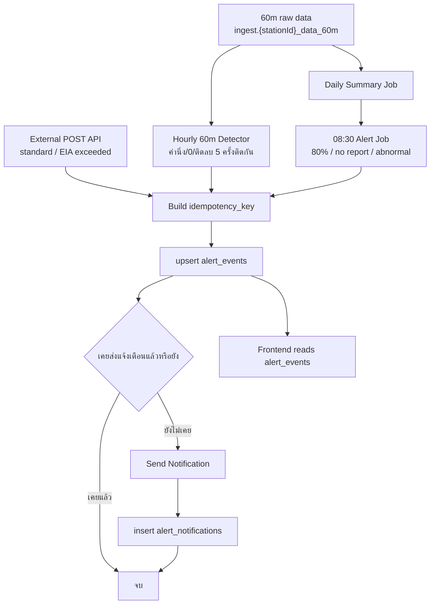

# POMS Alert Notification Design

เอกสารออกแบบระบบข้อมูลการแจ้งเตือน CEMS และ BOD/COD Online

## สรุปแนวทาง

ใช้ตารางกลาง `alert_events` เก็บเหตุการณ์แจ้งเตือนทุกประเภท แล้วแยกหน้าจอด้วย `systemType`, `displaySystemType`, `alertType`, `thresholdType` แทนการสร้างหลาย endpoint/หลายตารางตามเมนู

Source หลักแบ่งเป็น 2 ทาง:

- External API: ส่งเฉพาะรายการที่อีกทีมยืนยันแล้วว่าเกินมาตรฐานหรือเกินค่า EIA
- 60m raw data: ใช้คำนวณ 80%, no report, ค่านิ่ง/ค่า 0/ค่าติดลบ

ตารางที่ต้องเพิ่ม:

- `alert_events`
- `alert_notifications`
- `measurement_daily_summaries`

## Flow งาน



## ประเภทการแจ้งเตือน

| กลุ่ม | รายการแจ้งเตือน | `alertType` | แหล่งข้อมูล |
| --- | --- | --- | --- |
| CEMS | ผลการตรวจวัด CEMS เกินมาตรฐาน | `STANDARD_EXCEEDED` | รับ POST จาก API ภายนอกเท่านั้น |
| CEMS | ผลการตรวจวัด CEMS เกินค่า EIA กำหนด | `EIA_EXCEEDED` | รับ POST จาก API ภายนอกเท่านั้น |
| CEMS | รายงานผล CEMS ไม่ถึงร้อยละ 80 ต่อวัน | `DAILY_COMPLETENESS_LOW` | job 08:30 คำนวณจากข้อมูลวันก่อนหน้า |
| CEMS | ไม่รายงานผล CEMS ติดต่อกันเกิน 14 วัน | `CONSECUTIVE_NO_REPORT` | เริ่มแจ้งวันที่ 15 และแจ้งทุกวันจนกว่าจะมีค่ากลับเข้ามา |
| CEMS | รายงานผลตรวจวัด CEMS มีค่าผิดปกติ | `ABNORMAL_VALUE` | 60m rolling window |
| BOD/COD Online | ผลการตรวจวัด BOD/COD Online เกินมาตรฐาน | `STANDARD_EXCEEDED` | รับ POST จาก API ภายนอกเท่านั้น |
| BOD/COD Online | ผลการตรวจวัด BOD/COD Online เกินค่า EIA กำหนด | `EIA_EXCEEDED` | รับ POST จาก API ภายนอกเท่านั้น |
| BOD/COD Online | รายงานผล BOD/COD Online ไม่ถึงร้อยละ 80 ต่อวัน | `DAILY_COMPLETENESS_LOW` | job 08:30 คำนวณจากข้อมูลวันก่อนหน้า |
| BOD/COD Online | ไม่รายงานผล BOD/COD Online ติดต่อกันเกิน 7 วัน | `CONSECUTIVE_NO_REPORT` | เริ่มแจ้งวันที่ 8 และแจ้งทุกวันจนกว่าจะมีค่ากลับเข้ามา |
| BOD/COD Online | รายงานผลตรวจวัด BOD/COD Online มีค่าผิดปกติ | `ABNORMAL_VALUE` | 60m rolling window |

## Business Rules

### External API

ระบบภายนอกต้อง POST มาเฉพาะรายการที่ยืนยันแล้วว่า:

- เกินมาตรฐาน
- เกินค่า EIA

ฝั่ง POMS ไม่ต้องคำนวณซ้ำว่าเกินหรือไม่ แต่ต้อง:

- validate payload shape
- upsert ด้วย `idempotencyKey`
- ตรวจ `alert_notifications` ว่า event นี้เคยส่งแจ้งเตือนแล้วหรือยัง
- ถ้ายังไม่เคยส่ง จึงส่งแจ้งเตือน

### 80%

สูตร:

```text
normalStatusCount / (24 - shutDownStatusCount) * 100
```

กติกา:

- นับเฉพาะ status `Normal`
- หักช่วง `Shut Down` ออกจากตัวหาร
- normalize `SHUTDOWN`, `Shutdown`, `Shut Down` เป็น `Shut Down`
- ถ้า `24 - shutDownStatusCount = 0` ถือว่าวันนั้นไม่มีชั่วโมงที่ต้องรายงาน และไม่สร้าง alert 80%
- ถ้าผลลัพธ์ต่ำกว่า 80% ให้สร้าง `DAILY_COMPLETENESS_LOW`

### No Report

CEMS:

- ถ้าไม่มีค่ารายงานติดต่อกันเกิน 14 วัน ให้เริ่มแจ้งวันที่ 15
- หลังจากนั้นแจ้งทุกวันจนกว่าจะมีค่ากลับเข้ามา

BOD/COD Online:

- ถ้าไม่มีค่ารายงานติดต่อกันเกิน 7 วัน ให้เริ่มแจ้งวันที่ 8
- หลังจากนั้นแจ้งทุกวันจนกว่าจะมีค่ากลับเข้ามา

Reset:

- ถ้ามีค่ากลับมาอย่างน้อย 1 ค่า ให้ reset การนับ no report ใหม่
- ถ้าหลังจากนั้นค่าหายไปอีก หรือค่าที่เข้ามากลายเป็นค่านิ่ง/0/ติดลบ ให้เริ่มนับ sequence ใหม่

### Abnormal

สร้าง `ABNORMAL_VALUE` เมื่อเกิดอย่างใดอย่างหนึ่ง:

- ค่านิ่ง 5 ครั้งติดกัน
- ค่า 0 5 ครั้งติดกัน
- ค่าติดลบ 5 ครั้งติดกัน

ต้องเก็บช่วงแรกของวันไว้:

- `startedAt` = เวลาค่าครั้งที่ 1
- `confirmedAbnormalAt` = เวลาค่าครั้งที่ 5
- `endedAt` / `timeRange` = ช่วงเวลาที่แสดงในตาราง
- ถ้ามีค่าปกติกลับมา 1 ค่า ให้ reset sequence ใหม่

## Schema

### `alert_events`

```sql
CREATE TABLE alert_events (
  id BIGINT IDENTITY(1,1) PRIMARY KEY,

  alert_type VARCHAR(64) NOT NULL,
  system_type VARCHAR(16) NOT NULL,
  display_system_type VARCHAR(32) NOT NULL,

  factory_id VARCHAR(64) NULL,
  factory_name NVARCHAR(500) NOT NULL,
  factory_registration_no NVARCHAR(64) NULL,

  connected_measurement_point_id BIGINT NULL,
  station_id VARCHAR(64) NOT NULL,
  point_name NVARCHAR(255) NOT NULL,
  point_code VARCHAR(64) NULL,
  point_type VARCHAR(32) NULL,

  parameter_code VARCHAR(64) NOT NULL,
  parameter_name NVARCHAR(255) NOT NULL,
  parameter_label NVARCHAR(255) NOT NULL,
  unit NVARCHAR(64) NULL,

  event_date DATE NOT NULL,
  started_at DATETIME2 NULL,
  ended_at DATETIME2 NULL,

  measured_value DECIMAL(18,6) NULL,
  threshold_value DECIMAL(18,6) NULL,
  threshold_type VARCHAR(32) NULL,

  completeness_percent DECIMAL(5,2) NULL,
  consecutive_days INT NULL,
  abnormal_type VARCHAR(32) NULL,
  abnormal_streak_count INT NULL,
  first_abnormal_at DATETIME2 NULL,
  confirmed_abnormal_at DATETIME2 NULL,

  source_table VARCHAR(128) NULL,
  source_interval VARCHAR(16) NOT NULL DEFAULT '60m',
  source_payload_json NVARCHAR(MAX) NULL,
  evidence_json NVARCHAR(MAX) NULL,

  notification_status VARCHAR(32) NOT NULL DEFAULT 'AUTO',

  idempotency_key VARCHAR(220) NOT NULL,
  detected_at DATETIME2 NOT NULL DEFAULT SYSDATETIME(),
  created_at DATETIME2 NOT NULL DEFAULT SYSDATETIME(),
  updated_at DATETIME2 NOT NULL DEFAULT SYSDATETIME(),
  deleted_at DATETIME2 NULL
);
```

### `measurement_daily_summaries`

```sql
CREATE TABLE measurement_daily_summaries (
  id BIGINT IDENTITY(1,1) PRIMARY KEY,

  system_type VARCHAR(16) NOT NULL,
  factory_id VARCHAR(64) NULL,
  station_id VARCHAR(64) NOT NULL,
  parameter_code VARCHAR(64) NOT NULL,
  parameter_label NVARCHAR(255) NOT NULL,
  unit NVARCHAR(64) NULL,

  summary_date DATE NOT NULL,
  expected_count INT NOT NULL,
  received_count INT NOT NULL,
  normal_status_count INT NOT NULL DEFAULT 0,
  shutdown_status_count INT NOT NULL DEFAULT 0,
  completeness_percent DECIMAL(5,2) NOT NULL,

  null_count INT NOT NULL DEFAULT 0,
  zero_count INT NOT NULL DEFAULT 0,
  negative_count INT NOT NULL DEFAULT 0,
  same_value_max_streak INT NOT NULL DEFAULT 0,

  first_received_at DATETIME2 NULL,
  last_received_at DATETIME2 NULL,
  source_table VARCHAR(128) NULL,

  created_at DATETIME2 NOT NULL DEFAULT SYSDATETIME(),
  updated_at DATETIME2 NOT NULL DEFAULT SYSDATETIME()
);
```

### `alert_notifications`

```sql
CREATE TABLE alert_notifications (
  id BIGINT IDENTITY(1,1) PRIMARY KEY,
  alert_event_id BIGINT NOT NULL,
  channel VARCHAR(32) NOT NULL,
  recipient NVARCHAR(255) NULL,
  send_status VARCHAR(32) NOT NULL,
  error_message NVARCHAR(1000) NULL,
  sent_at DATETIME2 NULL,
  created_at DATETIME2 NOT NULL DEFAULT SYSDATETIME()
);
```

### Index

```sql
CREATE UNIQUE INDEX uq_alert_events_idempotency
ON alert_events(idempotency_key)
WHERE deleted_at IS NULL;

CREATE INDEX ix_alert_events_date_type
ON alert_events(event_date DESC, alert_type, system_type)
WHERE deleted_at IS NULL;

CREATE INDEX ix_alert_events_factory_date
ON alert_events(factory_id, event_date DESC)
WHERE deleted_at IS NULL;

CREATE INDEX ix_alert_events_station_param_date
ON alert_events(station_id, parameter_code, event_date DESC)
WHERE deleted_at IS NULL;

CREATE UNIQUE INDEX uq_daily_summary_station_param_date
ON measurement_daily_summaries(station_id, parameter_code, summary_date);
```

## External POST API

### Endpoint

```text
POST /api/v1/integrations/alert-events
```

Authentication:

```http
X-API-Key: <integration-key>
```

Backend อ่าน key จาก:

```bash
ALERT_EVENT_API_KEYS=alert-event-key-1,alert-event-key-2
```

หมายเหตุ backward compatibility: ถ้ายังไม่ได้ตั้ง `ALERT_EVENT_API_KEYS` ระบบจะ fallback ไปอ่าน `INTEGRATION_API_KEYS` ชั่วคราวเพื่อไม่ให้ deployment เดิมพังทันที แต่ production ใหม่ควรแยก key ตาม endpoint

### Request: CEMS เกินมาตรฐาน

```bash
curl -X POST "http://localhost:3000/api/v1/integrations/alert-events" \
  -H "Content-Type: application/json; charset=utf-8" \
  -H "X-API-Key: $ALERT_EVENT_API_KEY" \
  -d '{
    "systemType": "CEMS",
    "stationId": "S0001",
    "pointCode": "S0001",
    "parameterCode": "so2",
    "unit": "ppm",
    "eventDate": "2026-03-02",
    "startTime": "20:00",
    "endTime": "20:59",
    "measuredValue": 150,
    "thresholdValue": 60,
    "thresholdType": "STANDARD"
  }'
```

### Request: BOD/COD Online เกินค่า EIA

```bash
curl -X POST "http://localhost:3000/api/v1/integrations/alert-events" \
  -H "Content-Type: application/json; charset=utf-8" \
  -H "X-API-Key: $ALERT_EVENT_API_KEY" \
  -d '{
    "systemType": "WPMS",
    "stationId": "P0001",
    "pointCode": "P0001",
    "parameterCode": "cod",
    "unit": "mg/l",
    "eventDate": "2026-03-02",
    "startTime": "20:00",
    "endTime": "20:59",
    "measuredValue": 150,
    "thresholdValue": 100,
    "thresholdType": "EIA"
  }'
```

### Field ที่ external API ต้องส่ง

| Field | Required | ตัวอย่าง | หมายเหตุ |
| --- | --- | --- | --- |
| `systemType` | Yes | `CEMS`, `WPMS` | BOD/COD Online ใช้ `WPMS` |
| `stationId` | Yes | `S0001` | รหัสจุดตรวจวัดที่ต้อง match กับ connected measurement point ใน POMS |
| `pointCode` | Optional | `S0001` | ส่งมาได้ ถ้ามี; backend จะใช้ร่วมกับ `stationId` ตอน lookup |
| `parameterCode` | Yes | `so2`, `cod` | backend แปลงเป็น lower-case |
| `unit` | Yes | `ppm`, `mg/l` | backend สร้าง `parameterLabel` เป็น `PARAMETER (unit)` |
| `eventDate` | Yes | `2026-03-02` | วันที่ของเหตุการณ์ |
| `startTime`, `endTime` | Yes | `20:00`, `20:59` | เวลาแบบ `HH:mm`; backend สร้าง `startedAt/endedAt` เป็นเวลาไทย `+07:00` เอง |
| `measuredValue` | Yes | `150` | ค่าที่ตรวจวัดได้ |
| `thresholdValue` | Yes | `60` | ค่ามาตรฐาน/ค่า EIA ที่ถูกใช้เทียบ |
| `thresholdType` | Yes | `STANDARD`, `EIA` | backend ใช้สร้าง `alertType` เอง |

### Field ที่ external API ไม่ต้องส่ง

| Field | เจ้าของข้อมูล |
| --- | --- |
| `idempotencyKey` | backend generate จาก `systemType`, `stationId`, `parameterCode`, `alertType` ที่ derive แล้ว และ `startedAt` ที่สร้างจาก `eventDate/startTime` |
| `alertType` | backend derive จาก `thresholdType`: `STANDARD` -> `STANDARD_EXCEEDED`, `EIA` -> `EIA_EXCEEDED` |
| `displaySystemType` | backend derive จาก `systemType` |
| `factoryId`, `factoryName`, `factoryRegistrationNo` | backend lookup จาก `cems_wpms_connected_measurement_points` |
| `pointName`, `pointType` | backend lookup จาก `cems_wpms_connected_measurement_points` |
| `parameterName`, `parameterLabel` | backend derive จาก `parameterCode` และ `unit` |
| `notificationStatus` | backend ตั้งเป็น `AUTO`; ภายนอกส่งมาไม่ได้ |

ถ้า `stationId`/`pointCode` ไม่พบใน `cems_wpms_connected_measurement_points` backend จะ reject ด้วย `400 BAD_REQUEST` เพื่อไม่ให้เกิด alert ที่ข้อมูลโรงงานว่างหรือไม่ตรง

### Response: Created

```json
{
  "success": true,
  "data": {
    "id": 1001,
    "created": true,
    "duplicate": false,
    "idempotencyKey": "CEMS:S0001:so2:STANDARD_EXCEEDED:2026-03-02T20:00:00+07:00",
    "alertType": "STANDARD_EXCEEDED",
    "systemType": "CEMS",
    "notificationStatus": "AUTO",
    "detectedAt": "2026-03-03T08:30:05+07:00"
  }
}
```

### Response: Duplicate

```json
{
  "success": true,
  "data": {
    "id": 1001,
    "created": false,
    "duplicate": true,
    "idempotencyKey": "CEMS:S0001:so2:STANDARD_EXCEEDED:2026-03-02T20:00:00+07:00",
    "message": "Alert event already exists"
  }
}
```

## Frontend GET API

ใช้ endpoint เดียว:

```text
GET /api/v1/alert-events
```

Query กลาง:

| Query | Required | ตัวอย่าง | หมายเหตุ |
| --- | --- | --- | --- |
| `systemType` | Yes | `CEMS`, `WPMS` | BOD/COD Online ใช้ `WPMS` |
| `displaySystemType` | Optional | `BOD_COD_ONLINE` | ใช้ช่วยแยกหน้า BOD/COD |
| `alertType` | Yes | `STANDARD_EXCEEDED` | ประเภทแจ้งเตือน |
| `thresholdType` | เฉพาะ exceeded | `STANDARD`, `EIA` | แยกเกินมาตรฐานกับ EIA |
| `dateFrom`, `dateTo` | Recommended | `2026-03-01` ถึง `2026-03-31` | ควร default ช่วงสั้น |
| `factoryId`, `stationId`, `parameterCode` | Optional | `S0001`, `so2` | filter เฉพาะจุด |
| `page`, `pageSize` | Yes | `page=1&pageSize=20` | ต้อง paginate |

## GET API แต่ละตาราง

| เมนู/ตาราง | GET API | คอลัมน์ที่แสดง |
| --- | --- | --- |
| CEMS เกินมาตรฐาน | `/api/v1/alert-events?systemType=CEMS&alertType=STANDARD_EXCEEDED&thresholdType=STANDARD` | ชื่อโรงงาน, เลขทะเบียนโรงงาน, วันที่, เวลา, จุดตรวจวัด, พารามิเตอร์, ค่ามาตรฐาน, ผลตรวจวัด, หน่วย, สถานะการแจ้งเตือน |
| CEMS เกินค่า EIA | `/api/v1/alert-events?systemType=CEMS&alertType=EIA_EXCEEDED&thresholdType=EIA` | ชื่อโรงงาน, เลขทะเบียนโรงงาน, วันที่, เวลา, จุดตรวจวัด, พารามิเตอร์, ค่า EIA, ผลตรวจวัด, หน่วย, สถานะการแจ้งเตือน |
| CEMS ไม่ถึง 80% | `/api/v1/alert-events?systemType=CEMS&alertType=DAILY_COMPLETENESS_LOW` | ชื่อโรงงาน, เลขทะเบียนโรงงาน, จุดตรวจวัด, พารามิเตอร์, วันที่, ส่งร้อยละ, สถานะการแจ้งเตือน |
| CEMS ไม่รายงานเกิน 14 วัน | `/api/v1/alert-events?systemType=CEMS&alertType=CONSECUTIVE_NO_REPORT` | ชื่อโรงงาน, เลขทะเบียนโรงงาน, จุดตรวจวัด, พารามิเตอร์, ตั้งแต่วันที่, ถึงวันที่, รวม (วัน), สถานะการแจ้งเตือน |
| CEMS ค่าผิดปกติ | `/api/v1/alert-events?systemType=CEMS&alertType=ABNORMAL_VALUE` | ชื่อโรงงาน, เลขทะเบียนโรงงาน, จุดตรวจวัด, พารามิเตอร์, วันที่, เวลา, ความผิดปกติ, สถานะการแจ้งเตือน |
| BOD/COD เกินมาตรฐาน | `/api/v1/alert-events?systemType=WPMS&displaySystemType=BOD_COD_ONLINE&alertType=STANDARD_EXCEEDED&thresholdType=STANDARD` | ชื่อโรงงาน, เลขทะเบียนโรงงาน, วันที่, เวลา, จุดตรวจวัด, พารามิเตอร์, ค่ามาตรฐาน, ผลตรวจวัด, หน่วย, สถานะการแจ้งเตือน |
| BOD/COD เกินค่า EIA | `/api/v1/alert-events?systemType=WPMS&displaySystemType=BOD_COD_ONLINE&alertType=EIA_EXCEEDED&thresholdType=EIA` | ชื่อโรงงาน, เลขทะเบียนโรงงาน, วันที่, เวลา, จุดตรวจวัด, พารามิเตอร์, ค่า EIA, ผลตรวจวัด, หน่วย, สถานะการแจ้งเตือน |
| BOD/COD ไม่ถึง 80% | `/api/v1/alert-events?systemType=WPMS&displaySystemType=BOD_COD_ONLINE&alertType=DAILY_COMPLETENESS_LOW` | ชื่อโรงงาน, เลขทะเบียนโรงงาน, จุดตรวจวัด, พารามิเตอร์, วันที่, ส่งร้อยละ, สถานะการแจ้งเตือน |
| BOD/COD ไม่รายงานเกิน 7 วัน | `/api/v1/alert-events?systemType=WPMS&displaySystemType=BOD_COD_ONLINE&alertType=CONSECUTIVE_NO_REPORT` | ชื่อโรงงาน, เลขทะเบียนโรงงาน, จุดตรวจวัด, พารามิเตอร์, ตั้งแต่วันที่, ถึงวันที่, รวม (วัน), สถานะการแจ้งเตือน |
| BOD/COD ค่าผิดปกติ | `/api/v1/alert-events?systemType=WPMS&displaySystemType=BOD_COD_ONLINE&alertType=ABNORMAL_VALUE` | ชื่อโรงงาน, เลขทะเบียนโรงงาน, จุดตรวจวัด, พารามิเตอร์, วันที่, เวลา, ความผิดปกติ, สถานะการแจ้งเตือน |

## Response Examples

### เกินมาตรฐาน / เกิน EIA

```json
{
  "success": true,
  "data": [
    {
      "id": 1001,
      "alertType": "STANDARD_EXCEEDED",
      "systemType": "CEMS",
      "displaySystemType": "CEMS",
      "factoryId": "factory-001",
      "factoryName": "บริษัท 2584 จำกัด",
      "factoryRegistrationNo": "3-xx-xx",
      "eventDate": "2026-03-02",
      "eventDateText": "2-Mar-69",
      "timeRange": "20.00 - 20.59",
      "startedAt": "2026-03-02T20:00:00+07:00",
      "endedAt": "2026-03-02T20:59:59+07:00",
      "stationId": "S0001",
      "pointCode": "S0001",
      "pointName": "Stack 1",
      "parameterCode": "so2",
      "parameterName": "SO2",
      "parameterLabel": "SO2 (ppm)",
      "thresholdType": "STANDARD",
      "thresholdLabel": "ค่ามาตรฐาน",
      "thresholdValue": 60,
      "measuredValue": 150,
      "unit": "ppm",
      "notificationStatus": "AUTO",
      "notificationStatusLabel": "อัตโนมัติ"
    }
  ],
  "pagination": {
    "page": 1,
    "pageSize": 20,
    "total": 1
  }
}
```

### ไม่ถึง 80%

```json
{
  "success": true,
  "data": [
    {
      "id": 2001,
      "alertType": "DAILY_COMPLETENESS_LOW",
      "systemType": "CEMS",
      "factoryId": "factory-001",
      "factoryName": "บริษัท 2584 จำกัด",
      "factoryRegistrationNo": "3-xx-xx",
      "stationId": "S0001",
      "pointCode": "S0001",
      "pointName": "จุดที่ 1",
      "parameterCode": "nox",
      "parameterName": "NOx",
      "parameterLabel": "NOx (ppm)",
      "eventDate": "2026-03-02",
      "eventDateText": "2-Mar-69",
      "normalStatusCount": 16,
      "shutDownStatusCount": 1,
      "expectedStatusCount": 23,
      "completenessPercent": 69.5,
      "completenessFormula": "16 / (24 - 1) * 100",
      "completenessPercentText": "69.50",
      "notificationStatus": "AUTO",
      "notificationStatusLabel": "อัตโนมัติ"
    }
  ]
}
```

### ไม่รายงานติดต่อกัน

```json
{
  "success": true,
  "data": [
    {
      "id": 3001,
      "alertType": "CONSECUTIVE_NO_REPORT",
      "systemType": "WPMS",
      "displaySystemType": "BOD_COD_ONLINE",
      "factoryId": "factory-002",
      "factoryName": "บริษัท สวัสดี จำกัด",
      "factoryRegistrationNo": "3-yy-yy",
      "stationId": "P0001",
      "pointCode": "P0001",
      "pointName": "จุดที่ 1",
      "parameterCode": "cod",
      "parameterName": "COD",
      "parameterLabel": "COD (mg/l)",
      "startedAt": "2026-03-02T00:00:00+07:00",
      "endedAt": "2026-03-09T23:59:59+07:00",
      "dateFrom": "2026-03-02",
      "dateTo": "2026-03-09",
      "dateFromText": "2-Mar-69",
      "dateToText": "9-Mar-69",
      "consecutiveDays": 8,
      "alertDate": "2026-03-10",
      "alertDateText": "10-Mar-69",
      "willAlertAgainUntilValueReturns": true,
      "notificationStatus": "AUTO",
      "notificationStatusLabel": "อัตโนมัติ"
    }
  ]
}
```

### ค่าผิดปกติ

```json
{
  "success": true,
  "data": [
    {
      "id": 4001,
      "alertType": "ABNORMAL_VALUE",
      "systemType": "CEMS",
      "factoryId": "factory-001",
      "factoryName": "บริษัท 2584 จำกัด",
      "factoryRegistrationNo": "3-xx-xx",
      "stationId": "S0001",
      "pointCode": "S0001",
      "pointName": "จุดที่ 1",
      "parameterCode": "nox",
      "parameterName": "NOx",
      "parameterLabel": "NOx (ppm)",
      "eventDate": "2026-03-02",
      "eventDateText": "2-Mar-69",
      "timeRange": "10.00 - 14.00",
      "startedAt": "2026-03-02T10:00:00+07:00",
      "endedAt": "2026-03-02T14:59:59+07:00",
      "firstAbnormalAt": "2026-03-02T10:00:00+07:00",
      "confirmedAbnormalAt": "2026-03-02T14:00:00+07:00",
      "abnormalType": "CONSTANT",
      "abnormalLabel": "ค่านิ่ง",
      "abnormalStreakCount": 5,
      "sameValueStreak": 5,
      "measuredValue": 5,
      "unit": "ppm",
      "notificationStatus": "AUTO",
      "notificationStatusLabel": "อัตโนมัติ"
    }
  ]
}
```

## Idempotency Key

| กรณี | ตัวอย่าง key |
| --- | --- |
| เกินมาตรฐานรายชั่วโมง | `CEMS:S0001:so2:STANDARD_EXCEEDED:2026-03-02T20:00:00+07:00` |
| เกิน EIA รายชั่วโมง | `WPMS:P0001:COD:EIA_EXCEEDED:2026-03-02:20` |
| รายงานไม่ถึง 80% ต่อวัน | `CEMS:S0001:NOX:DAILY_COMPLETENESS_LOW:2026-03-02` |
| ไม่รายงานต่อเนื่อง | `WPMS:P0001:COD:CONSECUTIVE_NO_REPORT:2026-03-02:2026-03-09:ALERT_2026-03-10` |
| ค่านิ่ง/0/ติดลบ | `CEMS:S0001:NOX:ABNORMAL_VALUE:CONSTANT:2026-03-02:FIRST` |

## Job Strategy

| Job | รอบเวลา | อ่านจาก | เขียนไป |
| --- | --- | --- | --- |
| External exceeded event receiver | เมื่อระบบภายนอก POST เข้ามา | External API payload เฉพาะเกินมาตรฐาน/EIA | `alert_events` และตรวจ `alert_notifications` |
| Hourly abnormal detector | ทุกชั่วโมง หรือหลัง raw data เข้า | 60m rolling window: ค่านิ่ง 5 ครั้งติดกัน, ค่า 0 5 ครั้งติดกัน, ค่าติดลบ 5 ครั้งติดกัน | `alert_events` |
| Daily summary builder | หลังจบวัน หรือ 08:00 | 60m ของวันก่อนหน้า | `measurement_daily_summaries` |
| Daily completeness detector | 08:30 | `measurement_daily_summaries` | `alert_events` |
| No report detector | 08:30 | `measurement_daily_summaries` หรือ last seen | `alert_events` |
| Notification worker | ทุก 5 นาที หรือหลัง daily job | `alert_events` ที่ยังไม่ส่ง | `alert_notifications` |

## Windows Server Steps

ใช้ Windows Task Scheduler แทน cron

### Code

1. เพิ่ม module `alert-events`
2. เพิ่ม `POST /api/v1/integrations/alert-events`
3. เพิ่ม `GET /api/v1/alert-events`
4. เพิ่ม `GET /api/v1/alert-events/:id`
5. เพิ่ม `PATCH /api/v1/alert-events/:id/status`
6. เพิ่ม job scripts:
   - `npm run job:alerts:summary`
   - `npm run job:alerts:daily`
   - `npm run job:alerts:hourly`
   - `npm run job:alerts:notify`

### Task Scheduler

| Task | Trigger | Action | หมายเหตุ |
| --- | --- | --- | --- |
| Alert Daily Summary | ทุกวัน 08:00 | `npm run job:alerts:summary` | สรุปข้อมูล 60m ของวันก่อนหน้า |
| Alert Daily Detection | ทุกวัน 08:30 | `npm run job:alerts:daily` | ตรวจ 80%, no report, event รายวัน |
| Alert Hourly Abnormal | ทุกชั่วโมง | `npm run job:alerts:hourly` | ตรวจค่านิ่ง/0/ติดลบ 5 ครั้งติดกัน |
| Alert Notification Worker | ทุก 5 นาที หรือหลัง daily job | `npm run job:alerts:notify` | ส่งเฉพาะ event ที่ยังไม่เคยส่ง |

ตัวอย่าง Task Scheduler:

```text
Program/script:
C:\Program Files\nodejs\npm.cmd

Arguments:
run job:alerts:daily

Start in:
C:\inetpub\wwwroot\POMS-app\backend
```

### Test ก่อน Production

1. รัน migration บน staging DB
2. ยิง external POST 1 รายการ แล้วเช็ค `alert_events`
3. ยิง POST payload เดิมซ้ำ แล้วเช็คว่า backend generate `idempotencyKey` เดิมและไม่เกิด row ซ้ำ
4. รัน `npm run job:alerts:summary`
5. รัน `npm run job:alerts:daily`
6. seed 60m ให้มีค่านิ่ง/0/ติดลบ 5 ครั้งติดกัน แล้วรัน `npm run job:alerts:hourly`
7. รัน notification worker แล้วเช็คว่า event เดิมไม่ส่งซ้ำ
8. ทดสอบ `GET /api/v1/alert-events` ทั้ง 10 ตาราง
9. เปิด Task Scheduler history/log เพื่อยืนยันว่ารันตามเวลา
